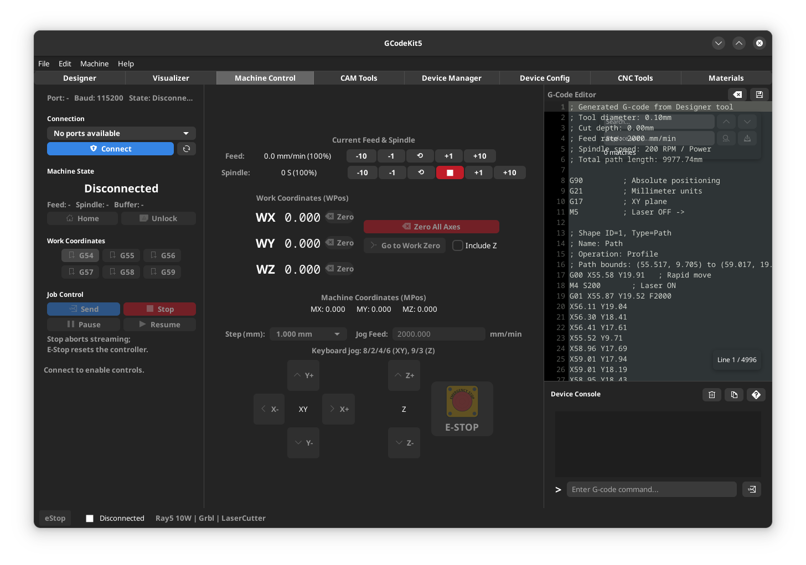
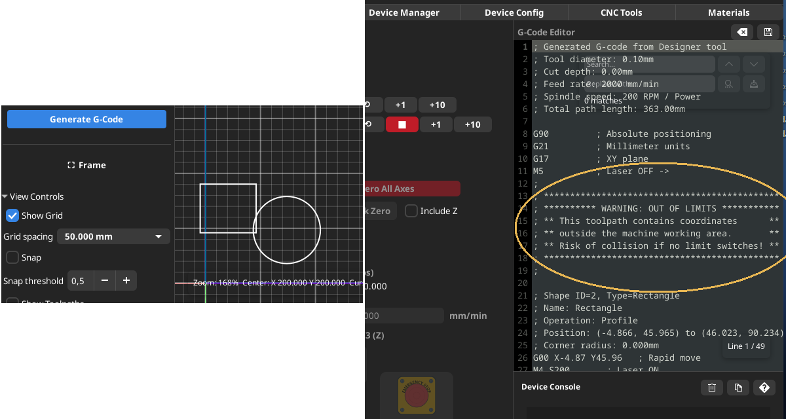

# Machine Control

Machine Control is the main place to connect to the controller and execute tasks.

---
## Connection
1. G-code Editor **Edit and review G-code** to run to the machine or save to a file using the "File" menu. You can also retrieve a previously saved file using the "File" menu.
2. Select the serial port. If it does not appear, press the Refresh button after turning on the machine.
3. Click **Connect**. It will appear as Connected.
4. **Device Console** to view startup messages and send commands to the machine.

If you have connection problems:
- Check the serial device permissions (e.g., `/dev/ttyACM0`).
- Confirm the correct baud rate for your firmware.

---
## Out of Bounds Warning

- If a design extends beyond the machine's working area, an **Out of Bounds Warning** will appear when the G-code is generated, prompting the user to take appropriate action.

---
## Manual Movement
- Use the on-screen control panel.
- Use manual keyboard control (if enabled) for quick positioning.
- Configure the **Step (mm)** and **Manual Feed** to control the movement.

---
## Start / Unlock / Reset
- **Start** executes the firmware startup cycle (requires `$22=1` in GRBL).
- **Unlock** clears alarms if the controller is in an alarm state.
- **Reset** performs a soft reset.

---
## Transmitting a Job
1. Once the G-code is loaded or generated.
2. Click **Send** to start the transmission.
3. Use **Pause/Resume** as needed.
4. **Stop** cancels the transmission.

## In case of emergency, press E-STOP and an emergency stop will be sent to the machine.
---
## Related
[Gcode Editor](help:gcode_editor)
[Device Console](help:device-console)
[Visualizer](help:visualizer)
[Index](help:index)
