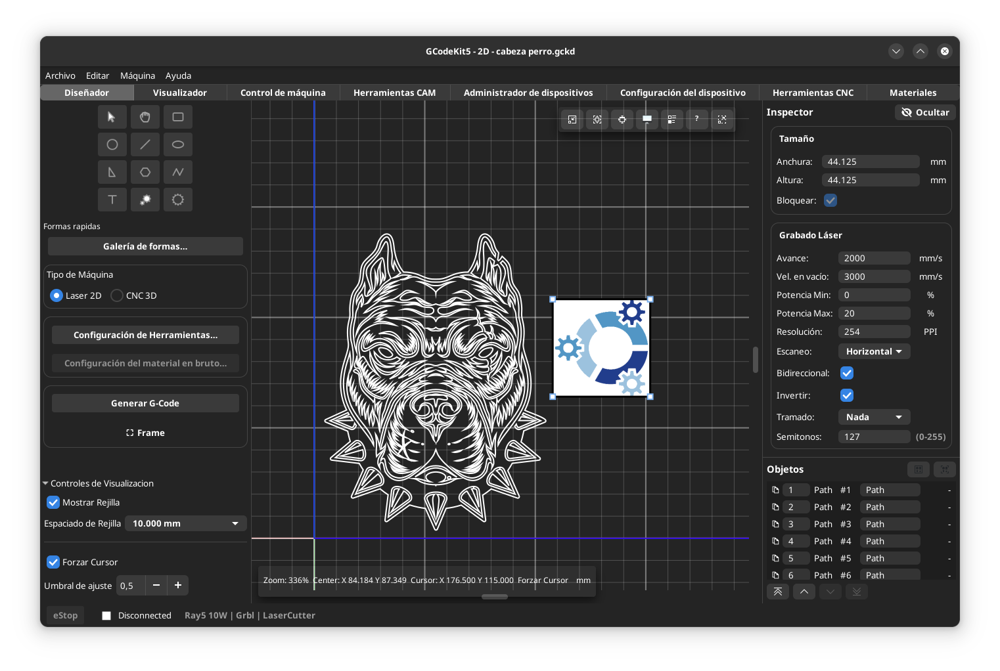
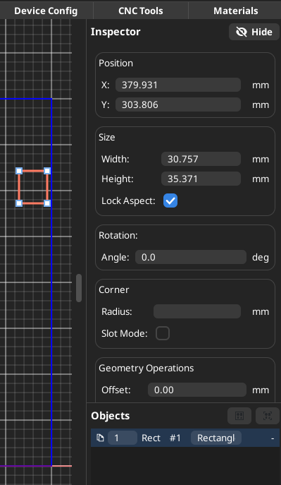

# Diseñador

El diseñador tiene dos modos diferenciados de trabajo: "Laser 2D" y "CNC 3D". Se puede entrar en ellos de dos formas, una desde el menú Archivo del Diseñador, haciendo "Nuevo 2D" o "Nuevo 3D". También se puede cambiar de modo mediante la selección de Tipo de Maquina del panel izquierdo.

En el modo Láser 2D no existe la coordenada Z por lo que está inhabilitada. Este modo se usa principalmente para grabado y corte por láser. En él se puede crear y editar objetos mediante las herramientas propias e importar diseños vectoriales como DXF y SVG. También se pueden importar Imágenes jpg, png etc para el grabado.

  

## Acciones principales en Modo Láser 2D
- Dibujar primitivas (rectángulos, círculos, líneas, elipses, polilineas, triangulos, Polígonos, Piñones, Engranajes)
- Añadir texto
- Añadir imágenes incluso hacer una composición de varias junto con los objetos vectoriales
- Definir independientemente los parámetros de grabado de cada imagen mediante sus propiedades
- Definir parámetros globales para aquellos objetos vectoriales que no precisen parámetros independientes
- Definir independientemente los parámetros de cada objeto vectoriales mediante sus propiedades
- Reordenar los Objetos en el panel de Objetos que se utilizará para la generación del G-code
- Importar archivos DXF y SVG.
- Advertencia de Fuera de Límites. Si algún punto sale fuera del área de trabajo, aparecerá en el G-code una advertencia de Fuera de Límites para que el usuario determine que hacer
- Exportar a G-code o SVG
- Generar el "Frame" para ajuste del material en máquina
- Generar el G-code final. Al generar el G-code se salta a la pestaña del Visualizador para comprobar el resultado antes de lanzar el trabajo.

---
## Propiedades globales
  

Pulsando el botón "Configuración de Herramienta" se abre la ventana para la configuración Global de trabajo. Esta Configuración se utilizará para todos los objetos vectoriales que tengan marcado el CheckBox "Usar Valores Globales" en las propiedades de objeto "Configuración Láser (Objeto)"

---
## Panel de Propiedades individuales de objeto
  
      En el panel lateral derecho, cuando se selecciona un objeto, aparecen sus propiedades:
        <li> Posición</li>
        <li> Tamaño</li>
        <li> Rotación</li>
        <li> Esquina (radio/redondeo)</li>
        <li> Operaciones Geométricas (desfase, chaflán)</li>
        <li> Propiedades CAM</li>
        <li> Configuración individual Láser (velocidad, potencia y pasadas) de un objeto determinado</li>

      ### Notas sobre Esquina y Chaflán
      - Para polilíneas (abiertas y cerradas), el redondeo de vértices se ajusta desde el panel Esquina usando Radius.
      - En objetos tipo Path, Radius (Esquina) y Chaflán son excluyentes para evitar geometrías duplicadas.
      - El valor de chaflán se aplica con medida real sobre la arista (por ejemplo, chaflán 10 = recorte de 10 mm por lado en una esquina de 90 grados).
---
## Panel de Objetos
  
      En el panel de objetos aparece la lista de objetos con:
        <li> Número de orden</li>Láser 2D
        <li> Tipo de objeto (Rectángulo, Circulo, Path, etc.) e identificación #</li>
        <li> Nombre del Objeto</li>
        <li> El número de orden es editable y sirve para organizar los objetos para que al generar el G-code, los objetos se ejecuten es ese orden.</li>
        <li> El Nombre también es editable, de modo que se puedan identificar los objetos convenientemente</li>

  
  <li> </li>

---
## Generador de Gcode y Frame
  
        - En el panel de la izquierda de Diseñador están los botones de "Generar G-Code" y "Frame". Después de terminar el diseño, es conveniente generar el perímetro del trabajo para poder enviar a la máquina y centrar el material. Una vez realizado este proceso, volver al diseñador para generar el G-Code definitivo mediante el botón. Una vez Generado, automáticamente saltará a la pestaña de Visualizador para comprobar como se realizará el trabajo. Si se está conforme, ir al Control de Máquina para lanzar el trabajo.

---
## Acciones principales en Modo CNC 3D
- En este modo se habilita la coordenada Z. **Esta coordenada es la dimensión a la que bajará la herramienta desde la cara superior del material**
- Definir parámetros globales para aquellos objetos vectoriales que no precisen parámetros independientes mediante el botón de "Configuración de material en bruto" y "Configuración de Herramienta". En el primero se abre un letrero de diálogo con las dimensiones del material, la altura de seguridad para la herramienta para los movimientos sin operar. En el segundo se abre un diálogo para introducir la velocidad de desplazamiento, las revoluciones de la herramienta, diametro y profundidad de pasada.
- Definir independientemente los parámetros de trabajo para cada objeto en el panel de propiedades, "Propiedades CAM". Cuando se utilizan los valores particulares de objeto, El valor Z se desprecia y se utiliza el valor de Profundidad de "Propiedades CAM".
- El resto es igual que en el Modo 2D
- **IMPORTANTE:** Los objetos que no tengan cota Z o tengan cota Z=0 se trazan en la cota superior del material ya que la cota Z siempre se considera en modo 3D hacia abajo.

---
## Relacionado
[Visualizador](help:visualizer)
[Control de Máquina](help:machine_control)
[Índice](help:index)

