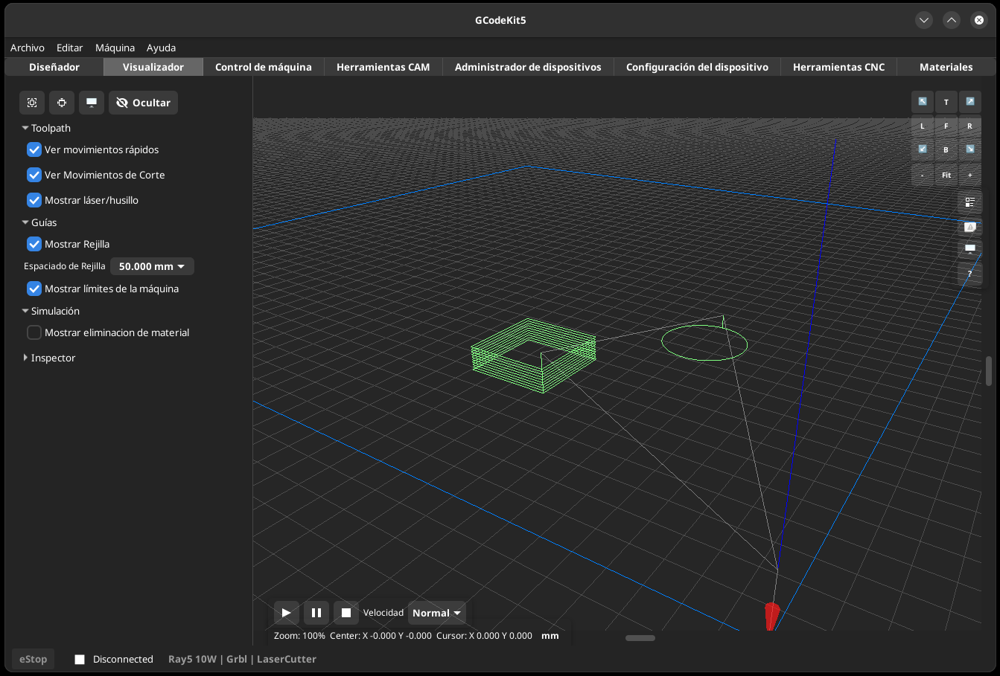
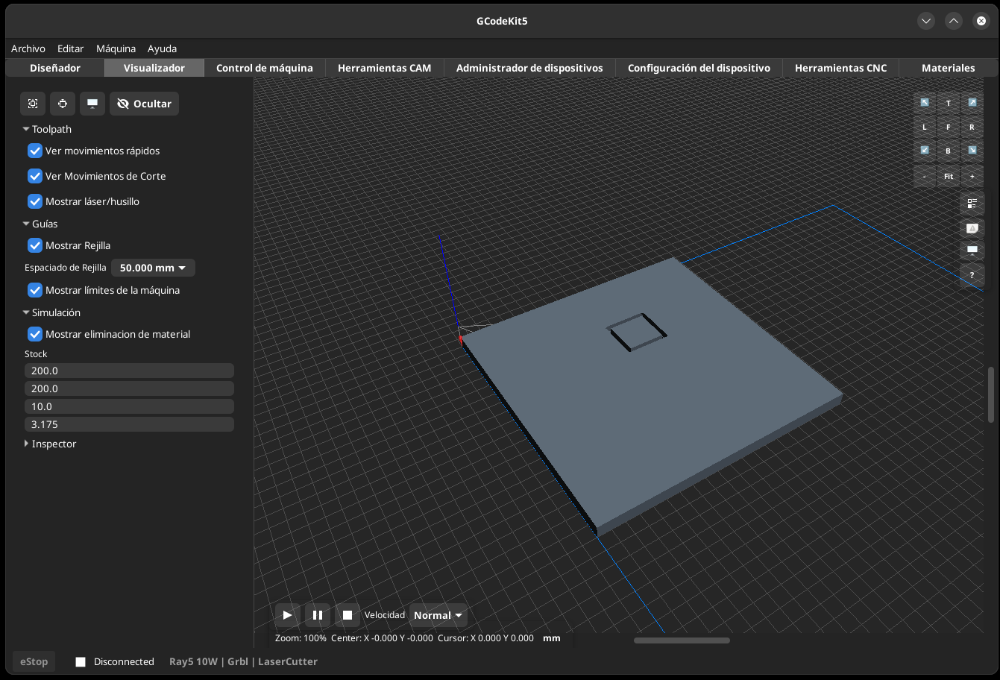

# Visualizador

El Visualizador muestra una vista previa de las trayectorias de la herramienta y (opcionalmente) los límites del área de trabajo de la máquina.
El visualizador es 3D y en la esquina superior derecha tiene los controles de visualización, Frontal, Lateral, trasera, isometricas, etc. Ajuste al dibujo, vista superior, zoom + y -, Visualización de barras de desplazamiento, Orbita.

- Mostrar/Ocultar Movimientos rápidos
- Mostrar/Ocultar Movimientos de corte
- Mostrar/ocultar Herramienta
- Mostrar/ocultar Rejilla. Se puede definir el paso de la rejilla
- Mostrar/Ocultar Límites de Máquina

- En la esquina inferior izquierda están los botones de Play/Pausa/Stop, para iniciar la simulación del movimiento de la herramienta. Hay un control de velocidad de reproducción con distintas velocidades según se desee.
Esta simulación también se puede iniciar mediante el menú Archivo/Run

- Hay un desplegable de Simulación con una casilla de verificación con la que se genera una visualización en 3D del material y lo que come la herramienta.

- Desplegable "Inspector" con los valores de bounds del trazado

## Relacionado
[Preferencias](help:settings)
[Control de Máquina](help:machine_control)
[Índice](help:index)
